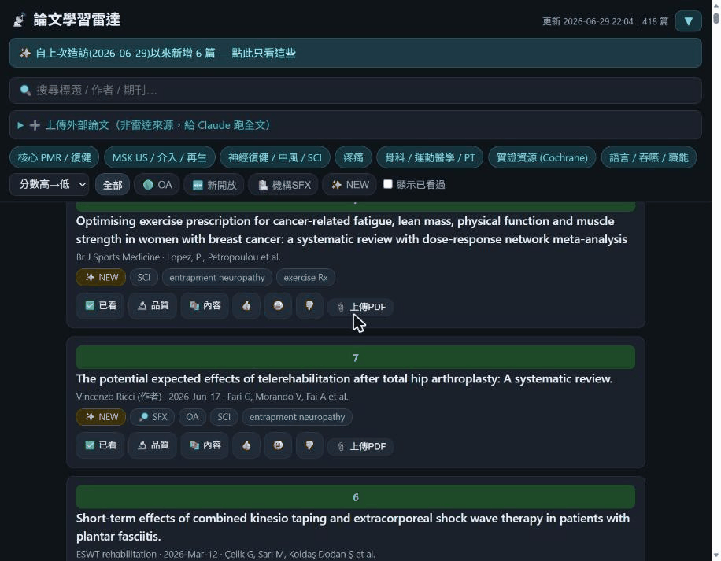
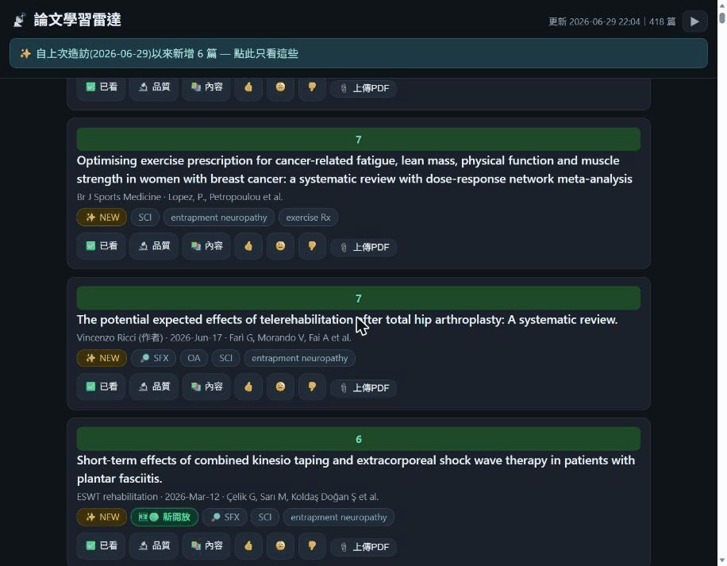
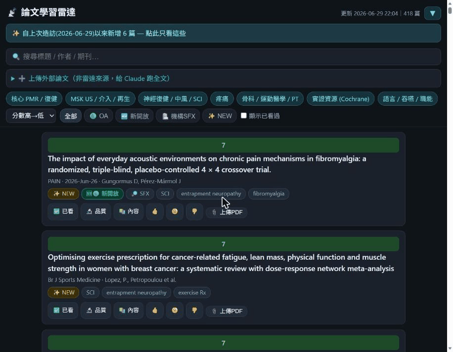

語言 Language： **繁體中文** ｜ [English](README.en.md)

# paper-radar · 論文學習雷達

> 一套**個人化的文獻追蹤與學習雷達**。把幾十個期刊 RSS／PubMed 搜尋自動抓回來、依你的研究興趣評分排序，推到一個**只給自己看的私密網頁**上滑、勾選；選中的論文再回流到你自己的筆記系統。最初是我為了準備**復健科（PMR, Physical Medicine & Rehabilitation）**專科與追新文而做的 side project，整理成可公開、可自架的開源版本。

🔒 我自己的站台跑在 Cloudflare Access 後面（私密、個人興趣資料），所以沒有公開 demo。下方以**截圖**呈現。

---

## 這是什麼 · 解決什麼問題

每天有幾十個期刊更新、加上幾位想追的作者、幾個想盯的主題，傳統作法是把一堆 RSS 倒進筆記軟體 → 很快變成讀不完的垃圾堆。我要的是一個會**幫我先篩、先排序**的雷達：

- 一次抓 **幾十個來源**（期刊 RSS + 作者／主題式 PubMed 搜尋），自動去重
- 依**我的研究興趣模型**評分排序——高分新文浮上來，雜訊沉下去
- 全部推到一個**私密網頁**（手機也能滑），每篇標「✅ 已看 / 🔬 想評讀品質 / 📚 想整理內容 / 👍😐👎」
- 每篇自動標好**能不能拿到全文**（開放取用？機構訂閱？要自己抓？）
- 我在網頁上勾的，之後一個指令**回流進我的筆記系統**整理
- 我的投票會**回頭訓練興趣模型**，雷達越用越準

> 這是一人維護的 side project。**核心（雷達本身）可自架重用**；「回流筆記」那段綁我個人的 Obsidian + LLM 工具鏈，請當成範例、接成你自己的下游。

## 架構

```
┌─────────────────────────────────────────────────────────────┐
│  主機（24/7 cron，我用 Oracle Cloud Free Tier 的一台小機）      │
│                                                               │
│  fetch_and_score.py                                           │
│    幾十個 feed（rss + pubmed_search）→ SQLite 去重             │
│    → interest_model 評分 → papers.json                        │
│  enrich.py                                                     │
│    每篇 DOI → Unpaywall（開放取用）                            │
│             + 機構 SFX / link resolver（訂閱判定，選用）       │
│  notify_digest.py  每日高分新篇 → ntfy 推播                    │
│             │ wrangler pages deploy                            │
└─────────────┼─────────────────────────────────────────────────┘
              ▼
┌─────────────────────────────────────────────────────────────┐
│  Cloudflare Pages（前面鎖 Cloudflare Access，只給你自己）       │
│    site/        私密網頁：主題開關 / 篩選 / 動作鈕 / 全文徽章   │
│    _worker.js   POST /api/action → D1                         │
│                 POST /api/upload → R2（外部 PDF）             │
│                 GET  /api/state  → 給下游拉未同步動作          │
│    D1 actions 表 = 你按的每個動作（跨裝置同步的真實來源）       │
└─────────────┬─────────────────────────────────────────────────┘
              ▼
        你的下游（範例：回流到筆記系統）
        讀 D1 未同步動作 → 抓全文 → 依 🔬/📚 分流整理 → 寫進筆記
        投票 → 回頭訓練 interest_model
```

## 核心功能

### 1 · 抓取 + 興趣評分（`fetch_and_score.py`）
- 兩種 feed 型別：`rss`（feedparser 抓 RSS/Atom）與 `pubmed_search`（用 NCBI E-utilities 跑 query，繞過壞掉的期刊 RSS、也能做作者／主題追蹤）。
- 所有來源寫進 SQLite，用 DOI／標題去重。
- 每篇用 `interest_model.json`（關鍵字／MeSH 權重）算興趣分數，前端預設高分優先。
- 經驗談都寫在註解裡：某些出版社 CDN 會擋自動請求（LWW）、某些 `search.rss` 的 XML 是壞的（部分 Springer 期刊）→ 一律改走 PubMed `[ta]` 比較穩。

### 2 · 全文三層（`enrich.py`）
每篇有 DOI 的論文，自動標好取得難度：

| 層 | 徽章 | 怎麼來 |
|---|---|---|
| 開放取用 | 🟢 OA | [Unpaywall](https://unpaywall.org/) 查 OA PDF（自動，免費） |
| 機構訂閱 | 🏥 機構訂閱 | **選用**：透過你機構的 SFX／link resolver 判定這篇現在能否經訂閱取得 |
| 自取 | 🔒 | 附深連結，由你自己抓／上傳 |

> ⚠️ **機構訂閱這層預設關閉**。它走的是你所屬機構的 link resolver（SExLibris SFX 之類的標準圖書館技術），只判定「**這篇現在能否取得**」並產生深連結——**取用與下載仍須遵守你機構的授權與各出版社的使用條款（ToS）**。沒有機構訂閱的人，把它關著、只用 OA 層即可。

### 3 · 私密網頁動作層（`site/` + Cloudflare D1/R2）
- 整站放在 **Cloudflare Access** 後面，只有你自己（email OTP / IdP）進得去——無 SEO、無公開 RSS、無署名。
- 每篇可標：✅ 已看、🔬 品質評讀、📚 內容整理、👍😐👎 投票、📎 上傳全文。
- 動作寫進 **Cloudflare D1**（SQLite），所以**換手機／換瀏覽器都看得到自己勾過什麼**（D1 是真實來源，localStorage 只是快取）。
- 可上傳非雷達來源的**外部 PDF** 進 R2（worker 內建月配額與單檔大小硬擋，避免爆免費額度）。
- 手機友善：設定區可折疊、搜尋常駐、已看過預設隱藏。

### 4 · 興趣訓練迴圈（`train_interest.py`）
- 你的 👍👎 投票 → 聚合每篇命中的主題 tag → 微調 `interest_model.json` 權重。
- 設計成**純函數、可重跑不漂移**（`effective = clamp(base + delta, 1, 5)`），預設 dry-run，`--apply` 才寫檔並備份。

### 5 · 推播（`notify_digest.py` / `notify_pending.py`）
- 每日把「夠新 + 夠高分 + 還沒看過」的論文摘要推到 [ntfy](https://ntfy.sh/)（含去重，不重推）。
- 另一支提醒你「網頁上還有 N 篇標了待處理」，催你去整理。

### 6 · 下游：回流你的筆記系統（概念性）
我自己的下游是一條跑在本機的 on-demand 流程，讀 D1 未同步動作 → 共用前置（DOI 核對、加進文獻管理、抓全文）→ 依徽章分流：**🔬 品質**走一條「可信度評讀」、**📚 內容**走一條「內容快速吸收整理」→ 寫進我的 Obsidian 筆記、投票寫進訓練 log。

> 這段**緊綁我個人的 Obsidian + LLM 工具鏈，不在本 repo 內**。`_worker.js` 的 `GET /api/state?unsynced=1` 就是給下游拉資料的接口——你可以接成任何你要的東西（存進 Notion、丟給某個 LLM 整理、寄 email 給自己……）。把它當成「雷達已經幫你篩好、排好、標好全文，剩下你愛怎麼用」。

## 技術棧與相依

| 層 | 用什麼 |
|---|---|
| 抓取／評分／加值 | Python 3.11+ · feedparser · requests · pyyaml · SQLite |
| 全文 | Unpaywall API（免費，需 email）· 選用機構 SFX/link resolver |
| 網頁 | 靜態 HTML/CSS/JS（無框架）· Cloudflare Pages |
| 動作層後端 | Cloudflare Workers（Pages advanced mode）· D1 · R2 |
| 推播 | ntfy |

### 我用的外部服務（可換等價方案）
這個專案我是搭在這幾個服務上的，**它們大多有免費額度**。你可以用一樣的，或換等價替代：

- **一台 24/7 的主機跑 cron** — 我用 [Oracle Cloud Free Tier](https://www.oracle.com/cloud/free/) 的 Always-Free 小機。**替代**：任何 VPS、家裡的 Raspberry Pi/NAS、GitHub Actions 排程⋯⋯只要能定時跑 Python 並執行 `wrangler` 即可。
- **靜態站 + 邊緣 DB/儲存** — 我用 **Cloudflare Pages + D1 + R2 + Access**（全在免費額度內）。**替代**：Vercel/Netlify + 任一 SQLite/Postgres、自架反向代理 + 基本認證。動作層只需要一個能存 KV/列的後端 + 一個把站鎖起來的認證。
- **推播** — 我用 **ntfy**（可自架或用公有 ntfy.sh）。**替代**：Telegram bot、Discord webhook、email。

> 換方案時主要改的是 `enrich.py`/`notify_*.py` 裡的端點，與部署腳本（`run.sh`/`deploy.sh`）。核心抓取＋評分（`fetch_and_score.py`）不依賴任何雲服務，本機就能跑。

## 截圖

> 站台在 Cloudflare Access 後，以下為實際畫面截圖（資料為公開文獻，無敏感內容）。



| 論文列表（全文徽章 🟢/🏥 + 動作鈕 ✅🔬📚👍） | 主題訂閱開關 / 篩選列 |
|---|---|
|  |  |

## 快速開始（本機跑抓取＋評分）

需求：Python 3.11+。

```bash
git clone https://github.com/<you>/paper-radar.git
cd paper-radar
python -m venv .venv && source .venv/bin/activate   # Windows: .venv\Scripts\activate
pip install -r requirements.txt

cp config.example.yaml config.yaml          # 編輯成你的 feeds / email / 站台網域
cp interest_model.example.json interest_model.json
cp env.example .env                          # 填 CF / ntfy 等（部署才需要）

# 純本機：抓取 + 評分（不需要任何雲服務）
python fetch_and_score.py                    # 全部 feed → papers.json
python fetch_and_score.py --only eswt,pain --limit 8   # 只跑某幾個 feed
python enrich.py --limit 20                  # 加值前 20 篇（OA / 機構訂閱）
```

打開 `site/index.html`（或 `python -m http.server` 起一個本機伺服器）即可看到前端讀 `papers.json` 渲染。`site/papers.sample.json` 是附的合成範例，方便 clone 後立刻看到畫面。

## 部署到 Cloudflare（私密站）

完整步驟見 [`docs/DEPLOY.md`](docs/DEPLOY.md)，摘要：

1. **D1**：`wrangler d1 create paper-radar-db` → `wrangler d1 execute paper-radar-db --remote --file=schema.sql`；把回傳的 database_id 填進 `wrangler.toml`（從 `wrangler.toml.example` 複製）。
2. **R2**（選用，上傳功能才需要）：`wrangler r2 bucket create paper-radar-pdfs`。
3. **Pages**：`wrangler pages deploy site --project-name=paper-radar`，綁自訂網域。
4. **Cloudflare Access**：在 Zero Trust 建一個 self-hosted application 蓋住你的網域，policy 只 allow 你自己的 email。**這一步是整個站「私密」的關鍵，務必先設好再放上任何資料。**
5. **主機 cron**：把專案 scp 到你的 host，建 venv，設 `.env`，cron 跑 `run.sh`。

## ⚠️ 自架上線前的安全與權限提醒

這個站雖然是給自己看的，但一旦放上網際網路就要當成公開服務來防護：

- **先鎖再放**：在把站接上公開網域的**同時**就設好 Cloudflare Access（或等價認證）。不要「先上線、晚點再鎖」——中間任何一刻它都是全網可讀的。
- **API token 用最小權限**：給主機 cron 的 Cloudflare token 只開 `Pages:Edit` + `D1:Read`（甚至不給 D1 寫）；需要改 schema（ALTER）時，用另一把有 `D1:Edit` 的 token，從你信任的機器跑，別把寫權限長駐在 host 上。
- **token / 帳密絕不進版控**：`.env`、`*.dpapi`、`wrangler.toml`（含真實 database_id）、產生的 `*.db` / `papers.json` 都已列入 `.gitignore`。commit 前再 `git status` 確認一次。
- **保留 worker 內的配額硬擋**（月上傳數、單檔大小），避免被誤用或自己手滑爆掉免費額度。
- **ntfy**：用有 token 的私有 topic，別用容易被猜到的公開 topic 名稱。
- **全文取用守規矩**：OA 層隨意；機構訂閱層的取用與下載，請遵守你機構授權與各出版社 ToS——本工具只幫你判定「可不可取得」並給連結，不繞過任何付費牆。

## 授權

[MIT](LICENSE)。歡迎 fork、改成你自己領域的雷達（不限醫學——任何有 RSS/API 的文獻源都行）。

---

*Built by 陳柏威 — 復健科醫師。本來只是想少漏幾篇好文。如果它對你追文獻有幫助，歡迎 star ⭐。*
